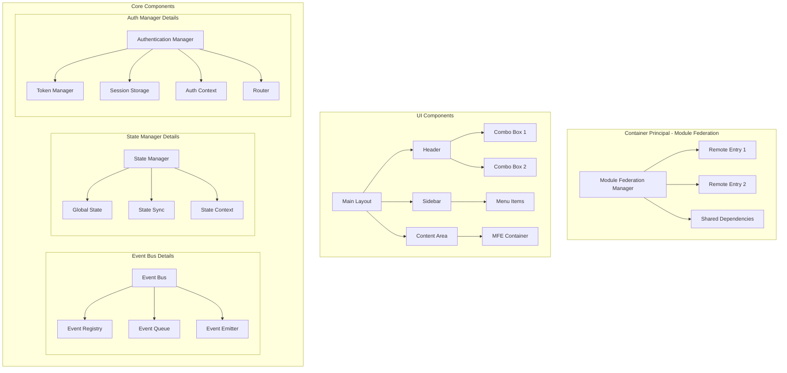
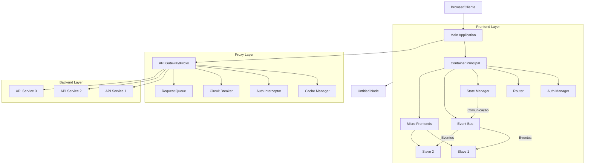
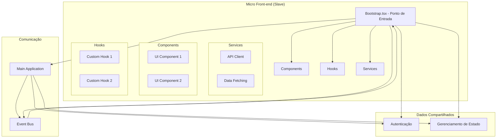
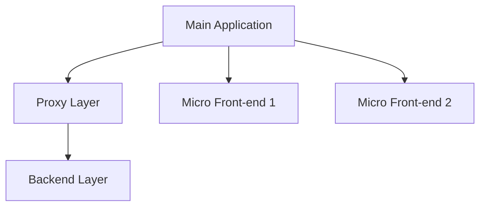

# POC Micro Front-end

Este é um projeto de prova de conceito (POC) para implementação de uma arquitetura de Micro Front-ends utilizando React.

---

## Diagrams

> MF Main arq



> MF solution macro



> MF Slave



## Visão Geral

O projeto demonstra uma implementação de Micro Front-ends com um aplicativo principal (main) que orquestra múltiplos aplicativos auxiliares (slaves). Esta arquitetura permite o desenvolvimento independente de diferentes partes da aplicação, mantendo a coesão e facilitando a manutenção.

## Estrutura e Arquitetura de Cada Projeto

### Aplicativo Principal: poc-micro-front-end--main

#### Responsabilidades:
- Gerenciamento de autenticação centralizada.
- Orquestração dos Micro Front-ends.
- Gerenciamento de estado global.
- Roteamento principal.
- Interface base, incluindo menus e layout.

#### Componentes Principais:
```
/src
├── /auth
│   ├── AuthProvider.tsx       # Contexto de autenticação.
│   ├── AuthGuard.tsx          # Proteção de rotas.
│   └── useAuth.tsx            # Hook de autenticação.
│
├── /core
│   ├── EventBus.ts            # Sistema de eventos.
│   ├── StateManager.ts        # Gerenciador de estado.
│   └── ModuleFederation.ts    # Configuração de Module Federation.
│
├── /layout
│   ├── MainLayout.tsx         # Layout principal.
│   ├── Header.tsx             # Cabeçalho com comboboxes.
│   └── Sidebar.tsx            # Menu lateral.
│
└── /shared
    ├── /components            # Componentes compartilhados.
    ├── /hooks                 # Hooks customizados.
    └── /utils                 # Utilitários.
```

#### Funcionalidades:
- **Autenticação**: Gerenciamento de login, tokens e controle de sessão.
- **Interface Principal**: Cabeçalho com comboboxes, menu lateral e área de conteúdo dinâmico.
- **Gerenciamento de Micro Front-ends**: Carregamento dinâmico e comunicação via sistema de eventos.
- **Gestão de Dependências**: Bibliotecas compartilhadas e resolução de conflitos de versões.

### Micro Front-ends: poc-micro-front-end--slave1 e poc-micro-front-end--slave2

#### Estrutura Comum:
```
/src
├── /components             # Componentes específicos do Micro Front-end.
├── /hooks                  # Hooks específicos.
├── /services               # Serviços específicos.
└── bootstrap.tsx           # Ponto de entrada.
```

#### Características:
- Integração com o sistema de autenticação e sessão do aplicativo principal.
- Consumo de eventos emitidos pelo aplicativo principal.
- Independência no desenvolvimento e deploy.

### Camada Proxy: poc-micro-front-end--proxy

#### Responsabilidades:
- Roteamento de requisições.
- Cache e balanceamento de carga.
- Autenticação e interceptadores de erros.

#### Estrutura do Proxy:
```
/proxy
├── /adapters                # Adaptadores para APIs.
├── /cache                   # Gerenciamento de cache.
├── /interceptors            # Interceptadores de requisição.
├── /queue                   # Sistema de filas.
└── /error-handling          # Tratamento de erros.
```

#### Componentes:
1. **Gateway API**: Responsável pelo roteamento e log centralizado.
2. **Gerenciamento de Cache**: Implementação de estratégias como `in-memory` e Redis.
3. **Interceptadores**: Manipula cabeçalhos, tokens e autenticação.
4. **Circuit Breaker**: Gerencia falhas e previne sobrecarga.

### Backend Layer (Camada de Backend)
- APIs REST independentes.
- Comunicação via proxy.
- Gerenciamento de autenticação e dados.

## Fluxos de Comunicação

1. **Autenticação**: O container principal gerencia tokens e distribui para os Micro Front-ends.
2. **Dados**: O proxy verifica cache antes de encaminhar para o backend.
3. **Comunicação Entre Módulos**: Utiliza um sistema de eventos baseado em `EventBus` para sincronização.

---

## Diagrama Geral da Arquitetura


## Desenvolvimento

1. Clone o repositório:
```bash
git clone https://github.com/seu-usuario/poc-micro-front-end.git
```

2. Instale as dependências:
```bash
cd poc-micro-front-end--main
npm install

cd ../poc-micro-front-end--proxy
npm install

cd ../poc-micro-front-end--slave1
npm install

cd ../poc-micro-front-end--slave2
npm install
```

3. Execute os projetos:
```bash
# Em terminais separados
cd poc-micro-front-end--main
npm start

cd ../poc-micro-front-end--proxy
npm start

cd ../poc-micro-front-end--slave1
npm start

cd ../poc-micro-front-end--slave2
npm start
```

A arquitetura do MF Slave (Micro Frontend Escravo) no contexto da POC Micro Front-end está baseada em conceitos de desacoplamento e modularidade. Seguem os pontos principais da arquitetura descrita nos arquivos:

### Estrutura do MF Slave
1. **Componentização:**
   - Cada MF Slave é um módulo independente que implementa suas funcionalidades específicas.
   - Estrutura típica de diretórios:
     ```
     /src
     ├── /components             # Componentes específicos do Micro Front-end.
     ├── /hooks                  # Hooks específicos do Micro Front-end.
     ├── /services               # Serviços específicos, como APIs ou lógica de domínio.
     └── bootstrap.tsx           # Ponto de entrada do Micro Front-end.
     ```

2. **Integração com o Main Application:**
   - Cada MF Slave é carregado dinamicamente pela aplicação principal usando o Module Federation do Webpack 5.
   - Comunicação via sistema de eventos configurado no Main Application.
   - A aplicação principal também compartilha dados de autenticação e estado global com os Slaves.

3. **Gerenciamento de Dependências:**
   - As dependências são resolvidas e compartilhadas entre o Main Application e os Slaves, minimizando redundâncias e conflitos.
   - Versões são gerenciadas para evitar incompatibilidades.

### Comunicação e Orquestração
- **Sistema de Eventos:**
  - Eventos, como alterações em combos ou atualizações no estado de autenticação, são emitidos pelo Main Application e consumidos pelos Slaves.
  - Exemplo de utilização:
    ```typescript
    // No Main Application:
    eventBus.emit('COMBO_CHANGED', { id: 1, value: 'new' });

    // No MF Slave:
    eventBus.on('COMBO_CHANGED', (payload) => {
      console.log('Combo changed', payload);
    });
    ```

- **Consumo de Dados:**
  - Os MF Slaves consomem APIs via camada Proxy configurada no Main Application.
  - Cache e autenticação são gerenciados no Proxy antes de os dados serem entregues.

### Exemplos de Configuração
**Module Federation no MF Slave:**
```javascript
const ModuleFederationPlugin = require("webpack/lib/container/ModuleFederationPlugin");

module.exports = {
  output: {
    publicPath: "http://localhost:3001/",
  },
  plugins: [
    new ModuleFederationPlugin({
      name: "slaveApp",
      filename: "remoteEntry.js",
      exposes: {
        "./Component": "./src/components/MyComponent",
      },
      shared: ["react", "react-dom"],
    }),
  ],
};
```

### Características
1. **Independência:**
   - Cada MF Slave pode ser desenvolvido, testado e implantado de forma independente.
2. **Reutilização:**
   - MF Slaves podem compartilhar componentes e bibliotecas com o Main Application e outros Slaves.
3. **Escalabilidade:**
   - A arquitetura permite a adição de novos Slaves sem impacto significativo no restante do sistema.


