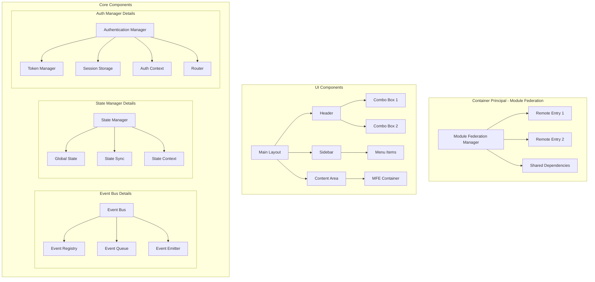
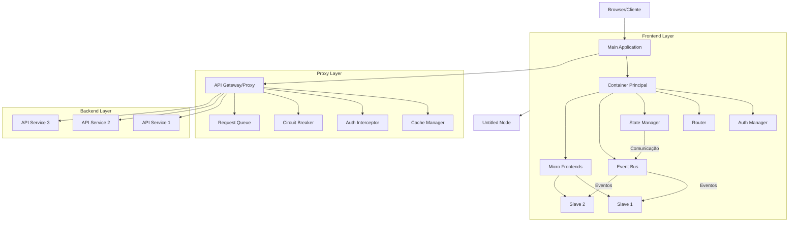
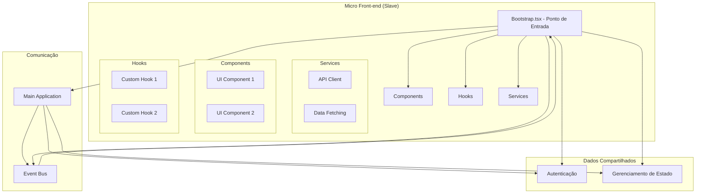
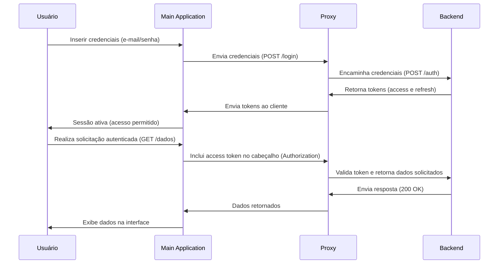
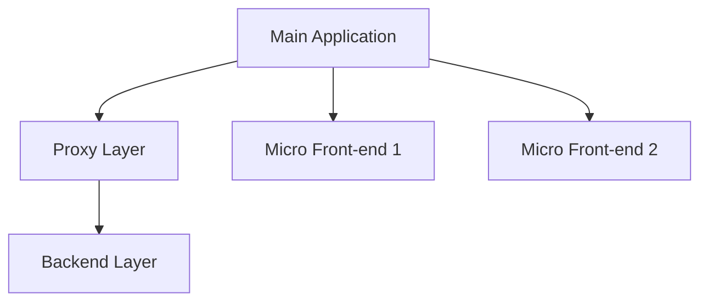

# POC Micro Front-end

Este é um projeto de prova de conceito (POC) para implementação de uma arquitetura de Micro Front-ends utilizando React.

---

## Diagrams

> MF Main arq



> MF solution macro



> MF Slave



## Visão Geral

O projeto demonstra uma implementação de Micro Front-ends com um aplicativo principal (main) que orquestra múltiplos aplicativos auxiliares (slaves). Esta arquitetura permite o desenvolvimento independente de diferentes partes da aplicação, mantendo a coesão e facilitando a manutenção.

## Estrutura e Arquitetura de Cada Projeto

### Aplicativo Principal: poc-micro-front-end--main

#### Responsabilidades:
- Gerenciamento de autenticação centralizada.
- Orquestração dos Micro Front-ends.
- Gerenciamento de estado global.
- Roteamento principal.
- Interface base, incluindo menus e layout.

#### Componentes Principais:
```
/src
├── /auth
│   ├── AuthProvider.tsx       # Contexto de autenticação.
│   ├── AuthGuard.tsx          # Proteção de rotas.
│   └── useAuth.tsx            # Hook de autenticação.
│
├── /core
│   ├── EventBus.ts            # Sistema de eventos.
│   ├── StateManager.ts        # Gerenciador de estado.
│   └── ModuleFederation.ts    # Configuração de Module Federation.
│
├── /layout
│   ├── MainLayout.tsx         # Layout principal.
│   ├── Header.tsx             # Cabeçalho com comboboxes.
│   └── Sidebar.tsx            # Menu lateral.
│
└── /shared
    ├── /components            # Componentes compartilhados.
    ├── /hooks                 # Hooks customizados.
    └── /utils                 # Utilitários.
```

#### Funcionalidades:
- **Autenticação**: Gerenciamento de login, tokens e controle de sessão.
- **Interface Principal**: Cabeçalho com comboboxes, menu lateral e área de conteúdo dinâmico.
- **Gerenciamento de Micro Front-ends**: Carregamento dinâmico e comunicação via sistema de eventos.
- **Gestão de Dependências**: Bibliotecas compartilhadas e resolução de conflitos de versões.

## Shared Dependencies

As dependências compartilhadas entre os Micro Front-ends são gerenciadas pelo Webpack Module Federation. O arquivo ModuleFederation.ts é responsável por expor e consumir módulos compartilhados. Isso ajuda a reduzir redundâncias e evitar conflitos de versão.

Aqui está uma nova seção detalhada para descrever como funciona a autenticação na aplicação, incluindo um diagrama de sequência para ilustrar o fluxo:

---

## Fluxo de Autenticação

A autenticação é um processo essencial na aplicação para garantir que apenas usuários autorizados tenham acesso às funcionalidades. O fluxo de autenticação é gerenciado pelo **Container Principal** (Main Application) em conjunto com a **Camada Proxy** e o **Backend**. 

A seguir, detalhamos como funciona o fluxo completo:

---

### **1. Descrição do Fluxo de Autenticação**

1. **Usuário inicia o login**:
   - O usuário insere suas credenciais (e-mail/senha) na interface de login do **Main Application**.

2. **Envio das credenciais**:
   - O Main Application envia as credenciais para a **Camada Proxy**.

3. **Validação no Backend**:
   - O **Proxy** encaminha a solicitação ao serviço de autenticação no **Backend**, que valida as credenciais fornecidas.

4. **Geração de tokens**:
   - Após a validação, o **Backend** retorna um **access token** (curta duração) e um **refresh token** (longa duração) para o **Proxy**.

5. **Distribuição do token**:
   - O **Proxy** envia os tokens de volta ao **Main Application**, que os armazena no navegador, geralmente no `localStorage` ou `HttpOnly cookies` para maior segurança.

6. **Acesso autenticado**:
   - O **Main Application** agora utiliza o **access token** para acessar os **Micro Front-ends** e consumir APIs, enquanto o **Proxy** gerencia a renovação do token automaticamente usando o **refresh token**.

---

### **2. Diagrama de Sequência**

O diagrama abaixo ilustra o fluxo de autenticação:



---

### **3. Considerações Importantes**

- **Tokens Seguros**:
  - Use `HttpOnly` cookies para armazenar os tokens, evitando ataques XSS.
  
- **Renovação do Token**:
  - O **Proxy** monitora o tempo de expiração do **access token** e usa o **refresh token** para renová-lo automaticamente antes de expirar.

- **Proteção de Rotas**:
  - O **Main Application** utiliza um **AuthGuard** para proteger as rotas e redirecionar o usuário para a página de login caso ele não esteja autenticado.

- **Erro de Autenticação**:
  - Caso o **access token** seja inválido ou expire e o **refresh token** também não seja aceito, o usuário será redirecionado para a tela de login.

---

### **4. Exemplo de Código**

#### **Envio de Credenciais**

```javascript
// Exemplo de envio de credenciais no login
async function login(email, password) {
    const response = await fetch('http://proxy-url/login', {
        method: 'POST',
        headers: {
            'Content-Type': 'application/json',
        },
        body: JSON.stringify({ email, password }),
    });

    if (response.ok) {
        const { accessToken, refreshToken } = await response.json();
        localStorage.setItem('accessToken', accessToken);
        localStorage.setItem('refreshToken', refreshToken);
    } else {
        console.error('Erro ao autenticar');
    }
}
```

#### **Proteção de Rotas**

```javascript
import { Navigate } from 'react-router-dom';

function AuthGuard({ children }) {
    const isAuthenticated = Boolean(localStorage.getItem('accessToken'));

    if (!isAuthenticated) {
        return <Navigate to="/login" />;
    }

    return children;
}
```


### Micro Front-ends: poc-micro-front-end--slave1 e poc-micro-front-end--slave2

#### Estrutura Comum:
```
/src
├── /components             # Componentes específicos do Micro Front-end.
├── /hooks                  # Hooks específicos.
├── /services               # Serviços específicos.
└── bootstrap.tsx           # Ponto de entrada.
```

#### Características:
- Integração com o sistema de autenticação e sessão do aplicativo principal.
- Consumo de eventos emitidos pelo aplicativo principal.
- Independência no desenvolvimento e deploy.

### Camada Proxy: poc-micro-front-end--proxy

#### Responsabilidades:
- Roteamento de requisições.
- Cache e balanceamento de carga.
- Autenticação e interceptadores de erros.

#### Estrutura do Proxy:
```
/proxy
├── /adapters                # Adaptadores para APIs.
├── /cache                   # Gerenciamento de cache.
├── /interceptors            # Interceptadores de requisição.
├── /queue                   # Sistema de filas.
└── /error-handling          # Tratamento de erros.
```

#### Componentes:
1. **Gateway API**: Responsável pelo roteamento e log centralizado.
2. **Gerenciamento de Cache**: Implementação de estratégias como `in-memory` e Redis.
3. **Interceptadores**: Manipula cabeçalhos, tokens e autenticação.
4. **Circuit Breaker**: Gerencia falhas e previne sobrecarga.

### Backend Layer (Camada de Backend)
- APIs REST independentes.
- Comunicação via proxy.
- Gerenciamento de autenticação e dados.

## Fluxos de Comunicação

1. **Autenticação**: O container principal gerencia tokens e distribui para os Micro Front-ends.
2. **Dados**: O proxy verifica cache antes de encaminhar para o backend.
3. **Comunicação Entre Módulos**: Utiliza um sistema de eventos baseado em `EventBus` para sincronização.

---

## Camada Proxy

A **Camada Proxy** centraliza a comunicação entre o **Frontend Layer** e o **Backend Layer**, fornecendo funcionalidades críticas que garantem performance, resiliência e segurança.

### Responsabilidades
- Roteamento de requisições entre MFEs e APIs backend.
- Implementação de autenticação centralizada.
- Gerenciamento de cache para reduzir latência.
- Manutenção de filas de requisição.
- Circuit Breaker para prevenir sobrecarga.

### Componentes
1. **Request Queue:**
   - Gerencia filas de requisições para evitar congestionamento.
   - Armazena requisições pendentes em caso de indisponibilidade temporária do backend.

2. **Circuit Breaker:**
   - Monitora falhas em APIs e bloqueia chamadas subsequentes para pontos de falha repetidos.
   - Proporciona feedback imediato ao cliente quando um endpoint está inativo.

3. **Auth Interceptor:**
   - Adiciona tokens de autenticação automaticamente aos cabeçalhos das requisições.
   - Garante que somente requisições autenticadas sejam enviadas ao backend.

4. **Cache Manager:**
   - Armazena respostas frequentes para economizar recursos e melhorar a latência.
   - Suporte a políticas como cache "time-to-live" (TTL).

---

### Fluxo de Comunicação

#### **Comunicação Síncrona**
1. O Micro Frontend (MFE) faz uma requisição HTTP ao Proxy usando `fetch` ou `axios`.
2. O Auth Interceptor adiciona o token de autenticação à requisição.
3. O Cache Manager verifica se a resposta está armazenada no cache.
   - **Cache Hit:** Retorna a resposta diretamente.
   - **Cache Miss:** Encaminha a requisição ao backend.
4. O Circuit Breaker monitora falhas.
5. O Proxy retorna a resposta ao MFE.

#### **Comunicação Assíncrona**

##### **1. Escutando um Evento**
```javascript
// Registrando um listener para eventos
eventBus.on('USER_UPDATED', (payload) => {
  console.log('Usuário atualizado:', payload);
});
```

##### **2. Long Polling**
```javascript
const longPolling = async () => {
  try {
    const response = await fetch('http://proxy-url/long-poll', { method: 'GET' });
    const data = await response.json();
    console.log('Dados recebidos:', data);
    longPolling(); // Continua escutando após receber dados
  } catch (error) {
    console.error('Erro no Long Polling:', error);
    setTimeout(longPolling, 5000); // Tenta novamente após intervalo
  }
};

longPolling();
```

##### **3. Publicação de Eventos**
```javascript
// Emitindo um evento
eventBus.emit('COMBO_BOX_UPDATED', { selectedValue: 'Novo Valor' });
```

##### **4. Postagem de um Evento**
```javascript
const postEvent


---

## Diagrama Geral da Arquitetura


## Desenvolvimento

1. Clone o repositório:
```bash
git clone https://github.com/seu-usuario/poc-micro-front-end.git
```

2. Instale as dependências:
```bash
cd poc-micro-front-end--main
npm install

cd ../poc-micro-front-end--proxy
npm install

cd ../poc-micro-front-end--slave1
npm install

cd ../poc-micro-front-end--slave2
npm install
```

3. Execute os projetos:
```bash
# Em terminais separados
cd poc-micro-front-end--main
npm start

cd ../poc-micro-front-end--proxy
npm start

cd ../poc-micro-front-end--slave1
npm start

cd ../poc-micro-front-end--slave2
npm start
```

A arquitetura do MF Slave (Micro Frontend Escravo) no contexto da POC Micro Front-end está baseada em conceitos de desacoplamento e modularidade. Seguem os pontos principais da arquitetura descrita nos arquivos:

### Estrutura do MF Slave
1. **Componentização:**
   - Cada MF Slave é um módulo independente que implementa suas funcionalidades específicas.
   - Estrutura típica de diretórios:
     ```
     /src
     ├── /components             # Componentes específicos do Micro Front-end.
     ├── /hooks                  # Hooks específicos do Micro Front-end.
     ├── /services               # Serviços específicos, como APIs ou lógica de domínio.
     └── bootstrap.tsx           # Ponto de entrada do Micro Front-end.
     ```

2. **Integração com o Main Application:**
   - Cada MF Slave é carregado dinamicamente pela aplicação principal usando o Module Federation do Webpack 5.
   - Comunicação via sistema de eventos configurado no Main Application.
   - A aplicação principal também compartilha dados de autenticação e estado global com os Slaves.

3. **Gerenciamento de Dependências:**
   - As dependências são resolvidas e compartilhadas entre o Main Application e os Slaves, minimizando redundâncias e conflitos.
   - Versões são gerenciadas para evitar incompatibilidades.

### Comunicação e Orquestração
- **Sistema de Eventos:**
  - Eventos, como alterações em combos ou atualizações no estado de autenticação, são emitidos pelo Main Application e consumidos pelos Slaves.
  - Exemplo de utilização:
    ```typescript
    // No Main Application:
    eventBus.emit('COMBO_CHANGED', { id: 1, value: 'new' });

    // No MF Slave:
    eventBus.on('COMBO_CHANGED', (payload) => {
      console.log('Combo changed', payload);
    });
    ```

- **Consumo de Dados:**
  - Os MF Slaves consomem APIs via camada Proxy configurada no Main Application.
  - Cache e autenticação são gerenciados no Proxy antes de os dados serem entregues.

### Exemplos de Configuração
**Module Federation no MF Slave:**
```javascript
const ModuleFederationPlugin = require("webpack/lib/container/ModuleFederationPlugin");

module.exports = {
  output: {
    publicPath: "http://localhost:3001/",
  },
  plugins: [
    new ModuleFederationPlugin({
      name: "slaveApp",
      filename: "remoteEntry.js",
      exposes: {
        "./Component": "./src/components/MyComponent",
      },
      shared: ["react", "react-dom"],
    }),
  ],
};
```

### Características
1. **Independência:**
   - Cada MF Slave pode ser desenvolvido, testado e implantado de forma independente.
2. **Reutilização:**
   - MF Slaves podem compartilhar componentes e bibliotecas com o Main Application e outros Slaves.
3. **Escalabilidade:**
   - A arquitetura permite a adição de novos Slaves sem impacto significativo no restante do sistema.


